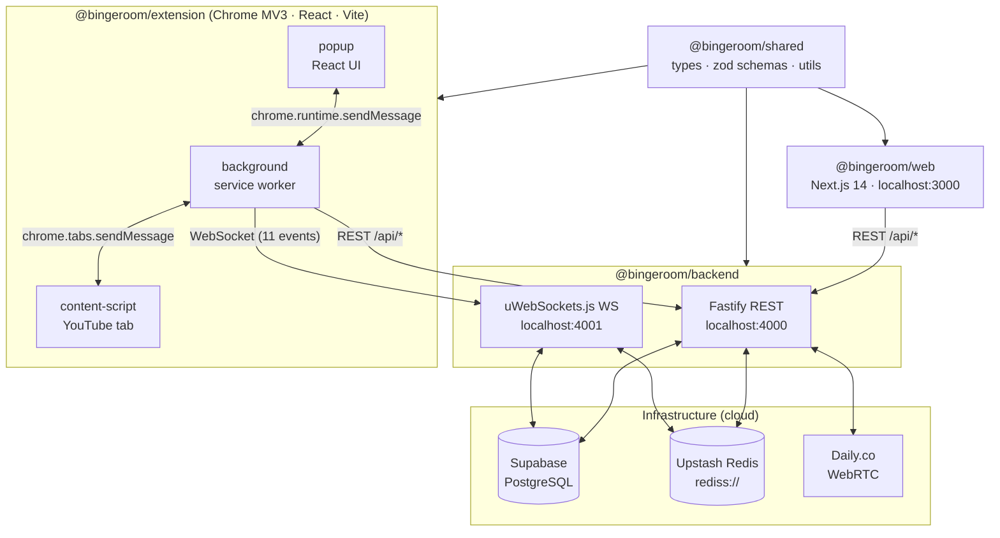
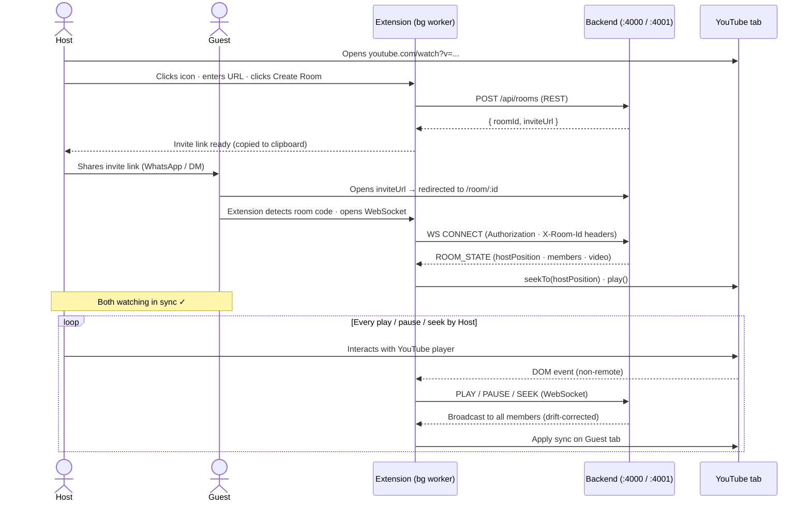

# BingeRoom

A Chrome extension for synchronized YouTube watch parties — play, pause, and seek in perfect sync across any number of viewers.

## What it does

BingeRoom keeps every member of a watch party frame-perfect — play, pause, or seek on one screen and everyone else follows within two seconds, automatically corrected for network drift. It works on any public YouTube video without screen-sharing, no subscription, free forever. The extension stays invisible inside the YouTube page: there is no overlay blocking controls, subtitles, or theatre mode, so you use YouTube exactly as normal. BingeRoom is built India-first, tuned for high-latency and variable-speed connections from day one.

## Architecture diagram



The monorepo has four packages. `@bingeroom/shared` holds the TypeScript types, Zod schemas, and utilities imported by every other package. `@bingeroom/backend` runs two servers: a Fastify REST API on port 4000 and a uWebSockets.js WebSocket server on port 4001 that drives real-time sync. `@bingeroom/web` is the Next.js 14 web app where users sign in, create rooms, and access invite links. `@bingeroom/extension` is the Chrome MV3 extension — a content script that controls the YouTube player, a background service worker that manages the WebSocket connection, and a React popup UI.

## User flow



When a guest opens the invite link, the extension reads the room code, opens an authenticated WebSocket connection, and receives a `ROOM_STATE` snapshot with the host's current playback position corrected for delivery time. From that point, every host play, pause, or seek is broadcast to all members over the WebSocket within two seconds.

## Tech stack

| Layer | Technology |
|-------|-----------|
| Monorepo | pnpm workspaces + Turborepo |
| Backend API | Fastify (REST) + uWebSockets.js (WebSocket) |
| Database | Supabase PostgreSQL + Prisma ORM |
| Cache / live state | Upstash Redis (rediss:// TLS) |
| Auth | Supabase OAuth (Google) + email/password |
| Video calls | Daily.co WebRTC |
| Web app | Next.js 14 + Tailwind CSS |
| Extension | Chrome Manifest V3 + React + Vite |
| Component dev | Ladle (localhost:61000) |

## Repository structure

```text
bingeroom/
├── packages/
│   ├── shared/          # Shared types, Zod schemas, and utilities (imported by all)
│   ├── backend/         # Fastify REST API + uWebSockets.js sync server
│   ├── web/             # Next.js 14 web app (rooms, auth, invite pages)
│   └── extension/       # Chrome Manifest V3 extension (content + popup + background)
├── docs/                # Architecture and API documentation
├── .env.example         # Environment variable template
├── .gitignore
├── package.json         # Workspace root
├── pnpm-workspace.yaml  # pnpm workspace definition
└── turbo.json           # Turborepo pipeline config
```

## Prerequisites

- Node.js 20+ (check with `node --version`)
- pnpm 9+ (`npm install -g pnpm`)
- Chrome browser (for extension development)
- Git

## Getting started

### 1. Clone the repo

```bash
git clone https://github.com/Bhargava-Ram-Thunga/Binge-Room.git
cd Binge-Room
```

### 2. Install dependencies

```bash
pnpm install
```

### 3. Set up environment

```bash
cp .env.example .env
```

Then fill in your credentials. See `docs/ENV.md` for where to find each value. You will need accounts on:

- [Supabase](https://supabase.com) (free) — database + auth
- [Upstash](https://upstash.com) (free) — Redis
- [Daily.co](https://daily.co) (free) — video calls

### 4. Set up database

```bash
pnpm --filter @bingeroom/backend db:migrate
```

### 5. Start development

```bash
pnpm dev
```

This starts all packages in parallel:

- Backend REST: http://localhost:4000
- Backend WebSocket: ws://localhost:4001
- Web app: http://localhost:3000
- Extension: `packages/extension/dist/` (load as unpacked in Chrome — see step 6)

### 6. Load the extension in Chrome

1. Open `chrome://extensions`
2. Enable **Developer mode** (toggle, top right)
3. Click **Load unpacked**
4. Select `packages/extension/dist`
5. Pin BingeRoom from the extensions menu

After any code change to the extension, Vite rebuilds automatically. Click the reload icon on the extension card in `chrome://extensions` to pick up the new build.

### 7. Test the sync

1. Open `youtube.com/watch?v=anything` in Chrome
2. Click the BingeRoom extension icon
3. Paste the YouTube URL and click **Create Watch Party**
4. Copy the invite link from the popup
5. Open the invite link in a second Chrome window or tab
6. Play the video in Tab 1 — Tab 2 should sync within 2 seconds

## Available commands

| Command | What it does |
|---------|-------------|
| `pnpm dev` | Start all packages in development mode |
| `pnpm build` | Build all packages for production |
| `pnpm test` | Run all tests |
| `pnpm lint` | Lint all packages |
| `make ext` | Build and zip extension for Chrome Web Store |
| `pnpm --filter @bingeroom/backend db:migrate` | Run database migrations |
| `pnpm --filter @bingeroom/backend db:studio` | Open Prisma Studio |
| `pnpm --filter @bingeroom/extension ladle` | Start Ladle component stories |
| `pnpm --filter @bingeroom/web dev` | Start web app only |

## Branch model

| Branch | Purpose | Merge rules |
|--------|---------|-------------|
| `prod` | Production only | 2 approvals required |
| `dev` | Integration | 1 approval required |
| `feat/*` | Feature work | PR to `dev` |
| `fix/*` | Bug fixes | PR to `dev` |
| `hotfix/*` | Prod fixes | PR to `prod` AND `dev` |

Never push directly to `prod` or `dev`.

## Documentation

| Doc | What it covers |
|-----|---------------|
| `docs/SCHEMA.md` | Complete database schema — every table, column, index |
| `docs/WS_EVENTS.md` | All 11 WebSocket events — payloads, error cases, race conditions |
| `docs/ENV.md` | Every environment variable — what it does, where to find it |
| `docs/API.md` | REST API endpoints — request/response shapes |
| `docs/AUTH_FLOW.md` | Auth sequence from sign-in to authenticated WebSocket |
| `docs/SYNC_ALGORITHM.md` | Drift correction math and host authority algorithm |
| `docs/EXTENSION_ARCHITECTURE.md` | Extension context message flow |

## Team

- **Bhargav** — extension, frontend, overlay UI, web app
- **Dinesh** — backend, WebSocket server, sync engine, database

## License

MIT
