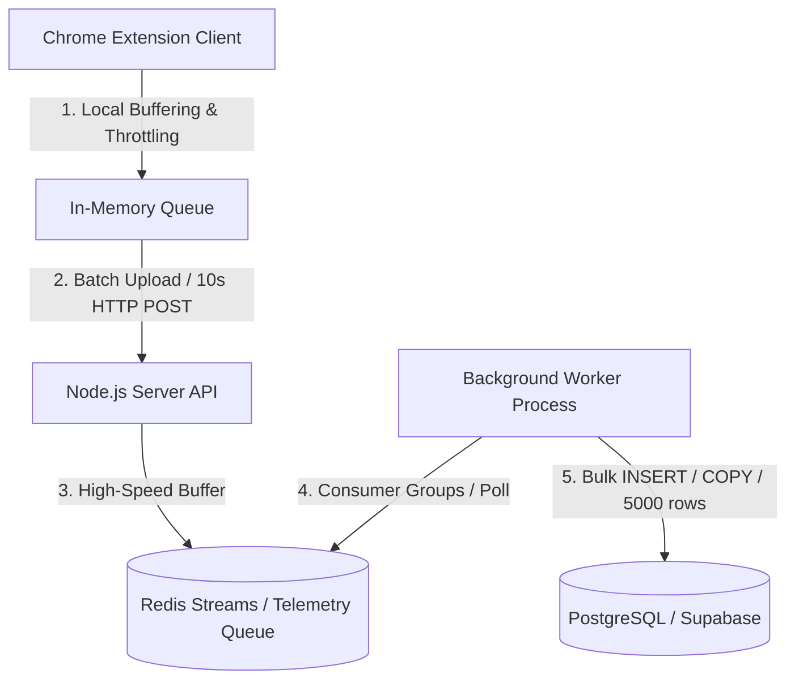

# Telemetry Database Schema Specification

This document details the database schema and event taxonomy designed to capture, store, and analyze room actions and fine-grained user interactions (clicks, keyboard shortcuts, hovers, playback syncs) in real time.

---

## 📐 Database Architecture (PostgreSQL)

To store high-volume telemetry events efficiently, we use a structured relational schema in PostgreSQL (Supabase) with optimized indexing. All telemetry events are normalized by `user_id` and `room_id` and logged in a central `telemetry_events` table with a flexible `JSONB` payload field.

### DDL Schema Definition

```sql
-- Enable UUID extension if not already enabled
CREATE EXTENSION IF NOT EXISTS "uuid-ossp";

-- 1. Users Table (Core profiles/sessions)
CREATE TABLE IF NOT EXISTS public.users (
    id UUID PRIMARY KEY DEFAULT uuid_generate_v4(),
    username VARCHAR(100) NOT NULL,
    created_at TIMESTAMPTZ NOT NULL DEFAULT NOW(),
    last_seen_at TIMESTAMPTZ NOT NULL DEFAULT NOW()
);

-- 2. Rooms Table (Session rooms history)
CREATE TABLE IF NOT EXISTS public.rooms (
    id UUID PRIMARY KEY DEFAULT uuid_generate_v4(),
    code VARCHAR(6) UNIQUE NOT NULL,
    creator_id UUID REFERENCES public.users(id) ON DELETE SET NULL,
    platform VARCHAR(50) NOT NULL, -- e.g., 'youtube', 'jiohotstar'
    created_at TIMESTAMPTZ NOT NULL DEFAULT NOW(),
    closed_at TIMESTAMPTZ
);

-- 3. Room Participants Table (Join/leave log for analytics)
CREATE TABLE IF NOT EXISTS public.room_participants (
    id UUID PRIMARY KEY DEFAULT uuid_generate_v4(),
    room_id UUID REFERENCES public.rooms(id) ON DELETE CASCADE,
    user_id UUID REFERENCES public.users(id) ON DELETE CASCADE,
    joined_at TIMESTAMPTZ NOT NULL DEFAULT NOW(),
    left_at TIMESTAMPTZ,
    user_agent TEXT,
    client_browser VARCHAR(50),  -- e.g., 'chrome', 'firefox', 'safari'
    client_os VARCHAR(50),       -- e.g., 'mac', 'windows', 'linux', 'ios', 'android'
    extension_version VARCHAR(20),-- extension software version
    ip_country VARCHAR(10),      -- country code derived from join request IP
    ad_blocker_active BOOLEAN   -- indicates if an adblocker was active at session join
);

-- 4. Telemetry Events Table (High-volume log table)
CREATE TABLE IF NOT EXISTS public.telemetry_events (
    id UUID PRIMARY KEY DEFAULT uuid_generate_v4(),
    room_id UUID REFERENCES public.rooms(id) ON DELETE SET NULL,
    user_id UUID REFERENCES public.users(id) ON DELETE SET NULL,
    event_category VARCHAR(32) NOT NULL, -- 'room', 'playback', 'ui', 'connection'
    event_name VARCHAR(64) NOT NULL,     -- e.g., 'play', 'click', 'hover', 'keydown'
    payload JSONB NOT NULL DEFAULT '{}'::jsonb,
    timestamp TIMESTAMPTZ NOT NULL DEFAULT clock_timestamp()
);

-- ─── Optimized Indexes for Analytics & Querying ──────────────────────────────

-- Query events sorted chronologically (latest first)
CREATE INDEX idx_telemetry_timestamp ON public.telemetry_events (timestamp DESC);

-- Query events occurring within a specific room
CREATE INDEX idx_telemetry_room_time ON public.telemetry_events (room_id, timestamp DESC);

-- Query events by user activity
CREATE INDEX idx_telemetry_user_time ON public.telemetry_events (user_id, timestamp DESC);

-- GIN index on JSONB payload for deep-filtering (e.g. searching specific selectors or videos)
CREATE INDEX idx_telemetry_payload_gin ON public.telemetry_events USING gin (payload);
```

---

## 🏷️ Event Categorization Taxonomy

Telemetry events are grouped into four primary categories (`event_category`): `room`, `playback`, `ui`, and `connection`.

### 1. `room` Events
Track session lifecycle and membership actions.

| Event Name | Description | Payload Schema |
| :--- | :--- | :--- |
| `room:create` | Host created a new room. | `{"code": "AB12CD", "platform": "youtube"}` |
| `room:join` | User successfully joined room. | `{"code": "AB12CD", "user_role": "guest"}` |
| `room:leave` | User left or disconnected. | `{"reason": "close_tab"}` / `{"reason": "heartbeat_timeout"}` |
| `host:change` | Host role was transferred. | `{"old_host_id": "uuid", "new_host_id": "uuid"}` |

### 2. `playback` Events
Track video playback sync engine behavior and events.

| Event Name | Description | Payload Schema |
| :--- | :--- | :--- |
| `playback:play` | User started video playback. | `{"video_id": "dQw4w9WgXcQ", "current_time": 42.5}` |
| `playback:pause` | User paused video playback. | `{"video_id": "dQw4w9WgXcQ", "current_time": 42.5}` |
| `playback:seek` | User dragged playback slider. | `{"video_id": "dQw4w9WgXcQ", "from_time": 10.2, "to_time": 42.5}` |
| `playback:ad_start` | Video ad began. | `{"video_id": "dQw4w9WgXcQ", "ad_index": 1}` |
| `playback:ad_end` | Video ad ended. | `{"video_id": "dQw4w9WgXcQ"}` |
| `playback:drift` | Sync engine adjusted video offset. | `{"drift_ms": 620, "actual_time": 43.1, "expected_time": 42.58}` |
| `playback:change` | Navigated to another video. | `{"from_video_id": "abc", "to_video_id": "xyz", "video_title": "Video Title", "video_duration": 180}` |
| `playback:rate_change`| User changed speed rate multiplier. | `{"video_id": "abc", "rate": 1.5}` |
| `playback:quality_change`| Video resolution quality updated. | `{"video_id": "abc", "quality": "1080p"}` |
| `playback:subtitle_change`| Closed captions / subtitle state modified. | `{"video_id": "abc", "enabled": true, "language": "en"}` |
| `playback:buffering` | Video player stalled/buffering. | `{"video_id": "abc", "duration_ms": 1420}` |

### 3. `ui` Events (Interaction Telemetry)
Track client-side browser user interactions inside the content frame or popup.

| Event Name | Description | Payload Schema |
| :--- | :--- | :--- |
| `ui:click` | Left click on page elements. | `{"selector": "button#play-button", "x": 120, "y": 450}` |
| `ui:hover` | Mouse hover over element. | `{"selector": "div.player-settings", "duration_ms": 1200}` |
| `ui:keydown` | Keyboard shortcut keys pressed. | `{"key": "Space", "code": "Space", "ctrl_key": false, "meta_key": false}` |
| `ui:volume` | Changed media volume. | `{"volume_level": 75, "muted": false}` |
| `ui:fullscreen`| Toggled fullscreen player. | `{"is_fullscreen": true}` |
| `ui:tab_focus` | Toggled active window tab focus. | `{"focused": false}` |

### 4. `chat` Events
Track session interactions and messaging volumes.

| Event Name | Description | Payload Schema |
| :--- | :--- | :--- |
| `chat:send` | User sent a chat message. | `{"message_length": 42, "has_mentions": false, "has_media": false}` |
| `chat:reaction` | User clicked / sent a quick emoji reaction. | `{"emoji": "🔥"}` |

### 5. `connection` Events
Track WebSocket connection stability and socket latency.

| Event Name | Description | Payload Schema |
| :--- | :--- | :--- |
| `connection:state`| Socket connection state changes. | `{"status": "connected"}` / `{"status": "reconnecting"}` |
| `connection:reconnect`| Log reconnect retry efforts. | `{"retry_count": 2, "elapsed_ms": 4500}` |
| `connection:rtt` | Socket round-trip ping time (latency). | `{"rtt_ms": 45}` |

### 6. `error` Events
Track application errors, crashes, and exceptions.

| Event Name | Description | Payload Schema |
| :--- | :--- | :--- |
| `error:player` | Native HTML5 / Player iframe exception. | `{"code": "MEDIA_ERR_DECODE", "message": "Video decode failed"}` |
| `error:extension`| Extension internal runtime JS exception. | `{"name": "TypeError", "message": "Cannot read property 'play' of null", "stack": "..."}` |

---

## ⚡ Performance & Scale Strategy (1 Million Users / 300k+ RPS Ingestion)

Capturing fine-grained client-side events (such as hovers, clicks, and keystrokes) for 1,000,000 active users will generate massive, high-throughput write traffic. Assuming an average of 1 event per 3 seconds per user, the system must ingest **~333,000 events/second**. 

To handle this scale without overloading PostgreSQL, we must implement a decoupled, asynchronous ingestion pipeline.



### 1. Client-Side Ingestion Safeguards (Chrome Extension)
* **Local In-Memory Queue**: Non-critical interaction telemetry (clicks, hovers, keypresses) must be queued in-memory. They are **never** sent individually.
* **Interval Flushes**: The client flushes the queue via a compressed JSON payload every `10` to `30` seconds or on tab unload.
* **Smart Filtering & Hover Debouncing**:
  - `ui:hover` is only captured if the cursor hovers over registered interactive components for more than `500ms`.
  - Mouse movement coordinate streaming (`mouse_move`) is entirely disabled. We only track distinct `ui:click` events.

### 2. High-Speed Gateway (Server / Node.js)
* **Dedicated Telemetry Route**: Do not route telemetry events over the real-time WebSocket connection to prevent blocking room sync traffic. Instead, use a lightweight HTTP POST endpoint `/api/telemetry/log`.
* **Redis Streams Buffering**: When the server receives a telemetry batch, it immediately appends it to a **Redis Stream** (e.g. `stream:telemetry`) or a Redis list. Sourcing it directly into memory takes `< 1ms` and leverages our existing Redis cluster, which can easily process `500k+` requests/sec.

### 3. Asynchronous Worker & Bulk Ingestion
* **Consumer Workers**: A separate worker process (or cluster) polls the Redis Stream using consumer groups.
* **Bulk PostgreSQL Ingestion**: Workers merge thousands of records and perform bulk inserts (e.g. using `INSERT INTO ... VALUES ...` or PostgreSQL's `COPY` API). This groups many writes into a single disk sync, improving PostgreSQL performance by orders of magnitude.
* **Minimize Indexes**: In the `telemetry_events` table, avoid multiple secondary indexes. Every index incurs a heavy write penalty. Keep only a composite index on `(room_id, timestamp DESC)`.

### 4. Database Partitioning & Archival
* **Partitioning**: Partition the `telemetry_events` table by time (e.g., daily partitions). 
* **Hot/Cold Storage**: Retain only 7 days of raw telemetry events in the "hot" PostgreSQL database. Run a nightly pipeline to export older event partitions to cold storage (e.g. AWS S3 as Parquet files, ClickHouse, or Snowflake) for historical data science analysis.

